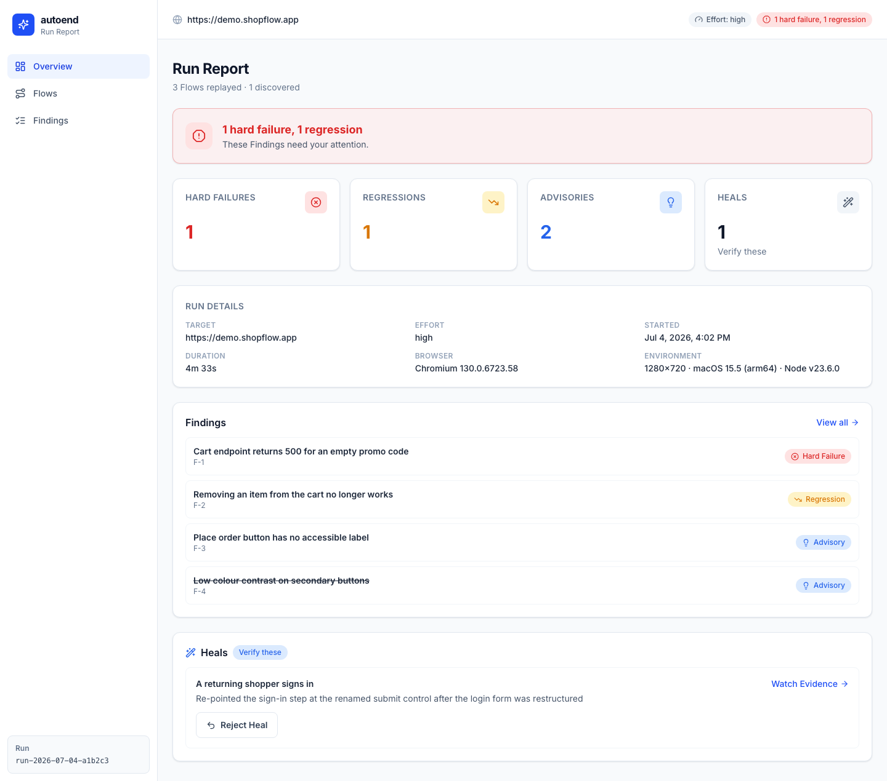
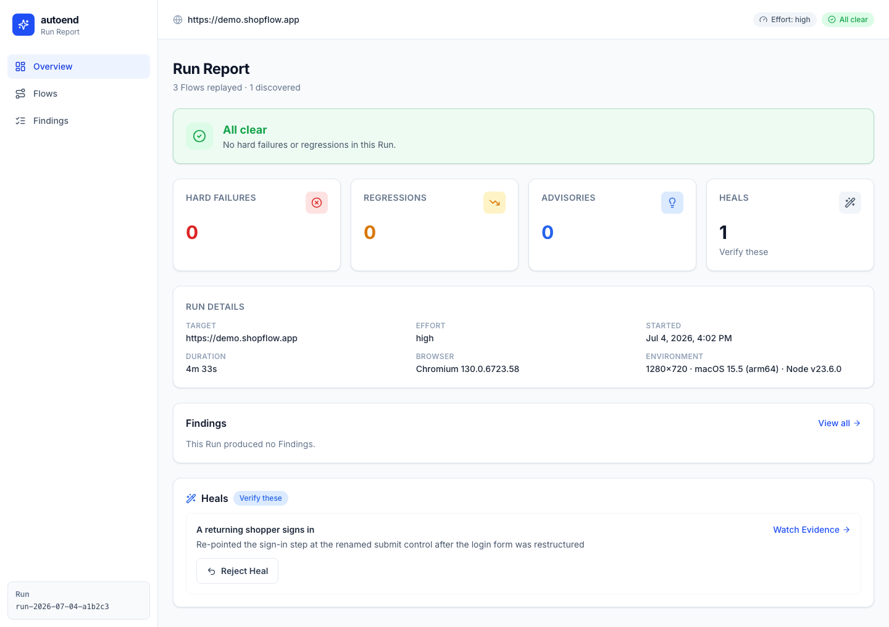

# autoend

[](https://www.npmjs.com/package/@bonyadnouri/autoend)
[](./LICENSE)

**Agent-powered end-to-end testing.** Point it at your app, walk away, get back a video-backed report.

```sh
npx @bonyadnouri/autoend init    # guided setup — takes a minute
npx @bonyadnouri/autoend         # agents test your app, a report opens
```



## Related projects

- **[lumen](https://github.com/an2323/lumen)** — React dashboard for viewing Run results (tests, issues, investigations).

## What is autoend?

autoend is **not a test framework** — you never write a test. It's an autonomous testing fleet with a memory:

- **You initiate a Run** against any URL — your localhost dev server, a staging deploy, a preview URL.
- **AI agents explore your app** like users would: clicking, filling forms, navigating — discovering the flows that matter ("a visitor can sign up", "a shopper can complete checkout").
- **Every flow that works gets written down** — as an ordinary Playwright script, committed to your repo. This is the **Flow Map**: your app's living baseline of what demonstrably works.
- **Every subsequent Run replays the whole map first** — deterministic, parallel, headless, no AI involved, seconds not minutes — then spends its exploration budget on new surface only.
- **You get a report in your browser**: a one-glance verdict, findings sorted into tiers, and a WebM video behind every claim so you can *watch* what the agent saw instead of parsing a stack trace.

The result: e2e coverage that grows on its own, catches regressions run-over-run, and never asks you to write or maintain a selector.

## How is it different?

| | You write tests? | LLM cost per run | Regression baseline | Exit path |
|---|---|---|---|---|
| **autoend** | Never | Only for *new* surface — replays are LLM-free | Flow Map, committed to git | Eject anytime: the map **is** a plain Playwright suite |
| Playwright / Cypress | Yes, by hand | None | Your hand-written suite | — |
| Playwright Test Agents | You supervise agents in your IDE, per test | None at runtime | Generated suite you own | — |
| Stagehand & AI-automation libs | Yes — you code the automation | Every run (unless you manage caches) | DIY | Tied to their runtime |

The three ideas doing the work:

1. **Tests are discovered, not authored.** Agents generate flows on the fly — but a proposed flow only enters the map after it's been **verified by actually executing it**. No hallucinated tests in your baseline.
2. **The LLM pays once per flow, not once per run.** Discovery costs tokens; the resulting artifact is deterministic Playwright that replays for free, forever. This is why a Run with a warm map takes seconds, not minutes.
3. **Evidence over assertion.** Every finding — failure, regression, or judgment call — links to a video recorded headless during the Run. "It broke" comes with the footage.

And because the Flow Map is plain Playwright in your own repo: branches carry their own baseline, teammates share it through git, agent changes show up in PRs like any other diff, and **there is no lock-in** — delete autoend tomorrow and you still own a working test suite.

## Install

Requirements:

- **Node.js ≥ 23.6** (flow scripts run via native TypeScript type-stripping)
- **A Cursor account + API key** — exploring agents run on the [Cursor SDK](https://cursor.com/docs/sdk/typescript) and bill to your Cursor plan. Get a key at [cursor.com → Dashboard → API Keys](https://cursor.com/dashboard).
- macOS, Linux, or Windows

```sh
# one-off, always latest
npx @bonyadnouri/autoend init

# or install globally and get the plain `autoend` command
npm i -g @bonyadnouri/autoend

# or straight from GitHub
npx github:bonyadnouri/autoend init

# one-time: fetch the headless browser used for replays
npx playwright install chromium
```

## Usage

### 1. Set up once

```
$ npx @bonyadnouri/autoend init

◆ Where does your app run?              http://localhost:3000
◆ How hard should a Run test by default?  mid — everyday runs · ~2-3 min
◆ Cursor API key                        ✓ saved to .env
◆ Supabase URL (Enter to skip publishing)  https://your-project.supabase.co
◆ Which Supabase key will you paste?    anon / publishable (recommended)
◆ Supabase key                          ✓ saved to .env
```

`init` writes `.autoend/config.json`, stores your keys in a gitignored `.env` (the Cursor API key that powers the agents, and — optionally — the Supabase URL + key that publishing needs; press Enter at the URL prompt to skip and keep Runs local), and updates your `.gitignore` so run artifacts and secrets never get committed.

### 2. Run

```
$ npx @bonyadnouri/autoend

Run starting http://localhost:3000 · effort mid
Run finished in 94.1s · 12 replayed · 2 discovered · all clear
Artifact: .autoend/runs/2026-07-04T10-01-00-000Z
Published to Supabase · 12 tests · 2 issues · 1 investigations
```

Your **first Run is a discovery run** — the map is empty, so agents spend the whole budget exploring and the map gets its first flows. Every Run after that opens by replaying everything already known, so regressions surface even at the lowest effort.

### 3. Read the report

Each Run writes its results to Supabase (see [Publishing results](#publishing-results-to-supabase)), where the Lumen dashboard reads them. Findings are sorted by how much you should care:

| Tier | Meaning | Your move |
|---|---|---|
| **Hard failure** | Objectively broken — 5xx, crashes, console errors | Fix it |
| **Defect** | Semantic bug (wrong data, lost state, dead control) that an independent Verifier **reproduced on video** — deep efforts only | Fix it |
| **Regression** | Worked in a previous run, failed now | Fix it — or remove the flow if the change was intentional |
| **Heal** | UI changed, goal still works; script was rewritten | Watch the video, confirm *(coming — see Status)* |
| **Advisory** | Agent judgment: UX, accessibility, speed | Your call |

Every finding carries a video. Watch it before you read another line of logs. At deep efforts (`high`+), findings also carry a **Disposition**: a Triage agent researches your git history and GitHub issues and annotates each finding as `bug`, `intended-change`, or `known-issue` — always with the commit/PR/issue receipts, never deciding for you. Dismissing stays your click; it just comes with the evidence already on screen.



### Publishing results to Supabase

A Run publishes its results to the Supabase project behind the Lumen dashboard. `autoend init` prompts for these and writes them to `.env`; to configure by hand instead, set (in the gitignored `.env`, or the shell):

```sh
SUPABASE_URL=https://your-project.supabase.co
# Preferred: the anon / publishable key — the Lumen tables allow anon writes and
# the evidence bucket is provisioned with anon upload policies (migration below).
SUPABASE_ANON_KEY=your-anon-key
# A service-role key also works, but it's higher blast radius if leaked:
# SUPABASE_SERVICE_ROLE_KEY=your-service-role-key
```

Apply the Lumen SQL migrations to the project first, including
[`002_evidence_bucket.sql`](../lumen/supabase/migrations/002_evidence_bucket.sql),
which creates the public `evidence` bucket and its anon upload/read policies.

> **Security:** the `evidence` bucket is **public** — uploaded WebM video and
> screenshots of your app are world-readable at a guessable URL. Point autoend
> at environments where that's acceptable (localhost, staging with test data),
> never production with real user data.

When set, each Run:

- writes real results into `tests` (from flows), `issues` (from findings), and `investigations` (evidence detail) under the `shopflow-default` analysis, and updates that analysis's summary counts;
- uploads each Run's WebM video to a public `evidence` Storage bucket and points the investigation's `replay.videoUrl` at it, so the dashboard plays the real recording;
- writes the analysis summary **last**, so `analyses.analyzed_at` is an atomic "this Run is fully published" marker — a newer timestamp means fresh, complete data.

Everything the Run does not produce (app map, journeys, insights) stays as the dashboard's seeded data. When the variables are unset, the Run still completes and writes its local artifact; it just prints a warning and skips publishing.

### 4. Choose your effort

Effort scales **exploration only** — replay of the full map always completes, at any level, so regression coverage is never sacrificed to a small budget. From `high` upward, Effort changes the exploration pipeline's *shape*, not just its duration (ADR-0007): a Recon agent reads your repo and briefs a fleet of persona explorers (naive newcomer → domain power user → adversarial prober …), suspected semantic bugs are only filed after an independent Verifier reproduces them on video, and a Triage agent checks git history and GitHub issues to annotate whether a change looks intentional.

```sh
npx @bonyadnouri/autoend -e low     # quick smoke pass         ~1-2 min
npx @bonyadnouri/autoend -e mid     # everyday smoke runs      ~2-3 min
npx @bonyadnouri/autoend -e high    # deep: recon + personas + verify + triage   ~15 min
npx @bonyadnouri/autoend -e xhigh   # deep, two lead-seeded waves                ~25 min
npx @bonyadnouri/autoend -e ultra   # full-depth bug hunt                        ~45-60 min
```

### CLI reference

```
autoend init               guided setup (target, effort, API key)
autoend [target-url]       start a Run (falls back to your configured target)
autoend clean              delete all local Run artifacts

  -e, --effort <level>     low | mid | high | xhigh | ultra
      --model <id>         Cursor model id for all agents (default: strongest available)
```

Model precedence: `--model` → `AUTOEND_MODEL` env var → `"model"` in `.autoend/config.json` → the strongest model your Cursor account can route (every agent role runs the same strong model by design — ADR-0009). The resolved model is printed at Run start and recorded in the report.

### Guardrails

Agents act on your app **for real**: they submit forms and click buttons. Two rails are built in — agents never navigate off the Target's origin, and they're instructed to avoid destructive or irreversible actions. The third rail is yours: **point autoend at an environment where real actions are safe** (localhost, staging with test data), never at production.

### Generated scripts run in-process (trust boundary)

Discovered and replayed Flow scripts are LLM-authored and executed in the Run's own Node process (verify-by-running, ADR-0002). That's a real trust boundary: a bad generation — or a prompt-injected Target page — could emit a script that reaches for the Node runtime. Two defense-in-depth mitigations are in place today: proposed scripts that reference disallowed APIs (`process.env`, `child_process`, dynamic `import()`/`require`, `eval`, …) are rejected before execution, and secret-looking environment variables (e.g. `CURSOR_API_KEY`) are stripped from `process.env` while any generated script runs. These are mitigations, not a sandbox — running scripts in a locked-down child process is tracked as follow-up work.

## The Flow Map is yours

```
.autoend/
├── flows/                 # the Flow Map — commit this
│   └── choose-pro-plan/
│       ├── flow.json      # metadata: title, discovered, last passed
│       └── flow.mts       # an ordinary Playwright script
├── brief.json             # Product Brief — Recon's understanding of your app; commit it
├── leads.json             # Lead ledger — unchased suspicions that seed the next Run; commit it
└── runs/                  # gitignored — reports + evidence videos
```

The Brief and the Lead ledger appear after your first deep Run (`-e high`+). Like the Flow Map, they version with your code: a branch carries its own product understanding, and the fleet gets smarter about your app Run over Run. The Brief regenerates automatically when it goes stale (the codebase moved substantially, or it aged out).

A discovered flow is exactly this readable:

```ts
// .autoend/flows/choose-pro-plan/flow.mts
export default async function flow(page, target) {
  await page.goto(new URL('/pricing', target).href);
  await page.getByRole('button', { name: 'Choose Pro' }).click();
  const status = await page.textContent('#plan');
  if (status !== 'Pro plan selected') throw new Error('expected confirmation, got ' + status);
}
```

To retire a flow whose feature you intentionally removed, delete its folder — the in-report Dismiss button is on the roadmap.

## Status

Early and honest about it. The architecture is settled, documented, and verified end-to-end; discovery quality and speed are actively being tuned.

- [x] Run pipeline: replay → explore → report artifact
- [x] Replay engine — parallel headless Playwright with per-flow video
- [x] Explorer fleet — Cursor agents driving [agent-browser](https://github.com/vercel-labs/agent-browser) in isolated sessions, verify-before-map-entry
- [x] Deep pipeline (`high`+): Recon → persona Waves → Verifier → Triage ([ADR-0007](./docs/adr/0007-staged-exploration-pipeline.md)/[0008](./docs/adr/0008-findings-earn-trust-by-reproduction-and-receipts.md))
- [x] Benchmark harness — seeded mini-app inner loop + Grafana real-history scaffolding ([ADR-0009](./docs/adr/0009-real-history-benchmark-validates-the-fleet.md)); first baseline numbers still to be produced
- [x] Results published to Supabase (Lumen dashboard) — verdict, tiers, embedded evidence. **Known gap:** the dashboard predates the deep pipeline — `defect` findings publish with a mapped severity, but Dispositions and violated expectations aren't rendered there yet; read them from the local `report.json`
- [x] Guided setup (`autoend init`)
- [ ] Heal-and-notify on replay failures
- [ ] Report resolution actions (dismiss / reject / suppress)
- [ ] Fleet auth — login once with a test account, share session across agents
- [ ] CI mode — Run artifacts as build artifacts

## Under the hood

Every load-bearing decision is written down — start with [`CONTEXT.md`](./CONTEXT.md) (the project glossary) and [`docs/adr/`](./docs/adr/):

1. [Fly-generated tests over an accumulated Flow Map](./docs/adr/0001-fly-generated-tests-over-accumulated-flow-map.md)
2. [agent-browser hands + Playwright artifacts](./docs/adr/0002-agent-browser-hands-playwright-artifact.md) — why exploration and replay use different engines
3. [Cursor SDK as the agent harness](./docs/adr/0003-cursor-sdk-as-agent-harness.md)
4. [Report as a static artifact + thin viewer](./docs/adr/0004-report-as-static-artifact.md)
5. [Lumen-derived React viewer](./docs/adr/0005-lumen-derived-react-viewer.md)
6. [Diagnosis at finding time](./docs/adr/0006-diagnosis-at-finding-time.md)
7. [Deep exploration is a staged pipeline of capability-separated roles](./docs/adr/0007-staged-exploration-pipeline.md) — Recon, Personas, Waves, Leads
8. [Findings earn trust by reproduction and receipts](./docs/adr/0008-findings-earn-trust-by-reproduction-and-receipts.md) — Defects and Dispositions
9. [A real-history benchmark validates the fleet](./docs/adr/0009-real-history-benchmark-validates-the-fleet.md)

The short version: exploration is LLM-latency-bound, so agents drive the browser through the most token-efficient hands measured anywhere (agent-browser, ~200–400 tokens per snapshot). Replay is reliability-bound, so flows persist as plain Playwright with auto-waiting and native video. The report is static files served by a dumb local viewer — portable to CI by construction.

## Benchmark: proving the fleet finds real bugs

"The fleet can find real bugs in well-known projects" is a falsifiable claim, so the repo ships its test ([ADR-0009](./docs/adr/0009-real-history-benchmark-validates-the-fleet.md)):

```sh
npm run bench:mini -- --mode discovery   # seeded mini-app: does the fleet rediscover 5 known bugs?
npm run bench:mini -- --mode upgrade     # does Triage recognize a deliberate UI change from git history?
```

The mini-app is the fast inner loop — deterministic, seeded bugs, minutes per run. The headline metric comes from real project history: run the fleet against Grafana pinned at a version whose bugs were fixed one release later, and count rediscoveries. See [`bench/README.md`](./bench/README.md) and [`bench/grafana/README.md`](./bench/grafana/README.md) for the curation playbook. **Both spawn real agent fleets and cost real Cursor tokens** — they measure and never gate, and pass bars get set from baseline data, not invented.

## Development

```sh
npm install
npm test              # vitest — includes a real browser replay integration test
npm run build         # tsc → dist/
npm run dev -- http://localhost:3000 -e low
```

## License

[MIT](./LICENSE)
