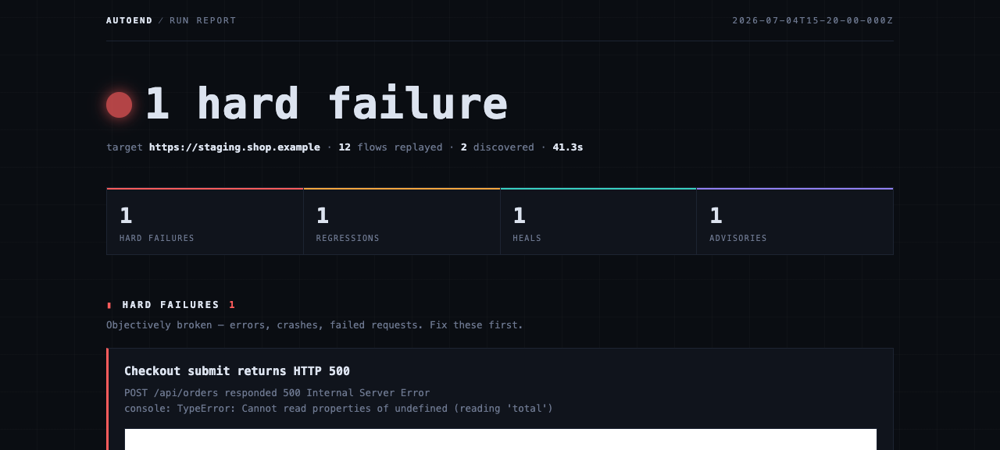
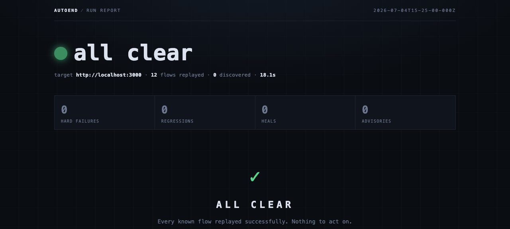

# autoend

[](https://www.npmjs.com/package/@bonyadnouri/autoend)
[](./LICENSE)

**Agent-powered end-to-end testing.** Point it at your app, walk away, get back a video-backed report.

```sh
npx @bonyadnouri/autoend init    # guided setup — takes a minute
npx @bonyadnouri/autoend         # agents test your app, a report opens
```



## What is autoend?

autoend is **not a test framework** — you never write a test. It's an autonomous testing fleet with a memory:

- **You initiate a Run** against any URL — your localhost dev server, a staging deploy, a preview URL.
- **AI agents explore your app** like users would: clicking, filling forms, navigating — discovering the flows that matter ("a visitor can sign up", "a shopper can complete checkout").
- **Every flow that works gets written down** — as an ordinary Playwright script, committed to your repo. This is the **Flow Map**: your app's living baseline of what demonstrably works.
- **Every subsequent Run replays the whole map first** — deterministic, parallel, headless, no AI involved, seconds not minutes — then spends its exploration budget on new surface only.
- **You get a report in your browser**: a one-glance verdict, findings sorted into tiers, and a WebM video behind every claim so you can *watch* what the agent saw instead of parsing a stack trace.

The result: e2e coverage that grows on its own, catches regressions run-over-run, and never asks you to write or maintain a selector.

## How is it different?

| | You write tests? | LLM cost per run | Regression baseline | Exit path |
|---|---|---|---|---|
| **autoend** | Never | Only for *new* surface — replays are LLM-free | Flow Map, committed to git | Eject anytime: the map **is** a plain Playwright suite |
| Playwright / Cypress | Yes, by hand | None | Your hand-written suite | — |
| Playwright Test Agents | You supervise agents in your IDE, per test | None at runtime | Generated suite you own | — |
| Stagehand & AI-automation libs | Yes — you code the automation | Every run (unless you manage caches) | DIY | Tied to their runtime |

The three ideas doing the work:

1. **Tests are discovered, not authored.** Agents generate flows on the fly — but a proposed flow only enters the map after it's been **verified by actually executing it**. No hallucinated tests in your baseline.
2. **The LLM pays once per flow, not once per run.** Discovery costs tokens; the resulting artifact is deterministic Playwright that replays for free, forever. This is why a Run with a warm map takes seconds, not minutes.
3. **Evidence over assertion.** Every finding — failure, regression, or judgment call — links to a video recorded headless during the Run. "It broke" comes with the footage.

And because the Flow Map is plain Playwright in your own repo: branches carry their own baseline, teammates share it through git, agent changes show up in PRs like any other diff, and **there is no lock-in** — delete autoend tomorrow and you still own a working test suite.

## Install

Requirements:

- **Node.js ≥ 23.6** (flow scripts run via native TypeScript type-stripping)
- **A Cursor account + API key** — exploring agents run on the [Cursor SDK](https://cursor.com/docs/sdk/typescript) and bill to your Cursor plan. Get a key at [cursor.com → Dashboard → API Keys](https://cursor.com/dashboard).
- macOS, Linux, or Windows

```sh
# one-off, always latest
npx @bonyadnouri/autoend init

# or install globally and get the plain `autoend` command
npm i -g @bonyadnouri/autoend

# or straight from GitHub
npx github:bonyadnouri/autoend init

# one-time: fetch the headless browser used for replays
npx playwright install chromium
```

## Usage

### 1. Set up once

```
$ npx @bonyadnouri/autoend init

◆ Where does your app run?              http://localhost:3000
◆ How hard should a Run test by default?  mid — everyday runs · ~2-3 min
◆ Cursor API key                        ✓ saved to .env
```

`init` writes `.autoend/config.json`, stores your API key in a gitignored `.env`, and updates your `.gitignore` so run artifacts and secrets never get committed.

### 2. Run

```
$ npx @bonyadnouri/autoend

Run starting http://localhost:3000 · effort mid
Run finished in 94.1s · 12 replayed · 2 discovered · all clear
Report: http://127.0.0.1:53211/
```

Your **first Run is a discovery run** — the map is empty, so agents spend the whole budget exploring and the map gets its first flows. Every Run after that opens by replaying everything already known, so regressions surface even at the lowest effort.

### 3. Read the report

A browser tab opens with the verdict up top and findings below, sorted by how much you should care:

| Tier | Meaning | Your move |
|---|---|---|
| **Hard failure** | Objectively broken — 5xx, crashes, console errors | Fix it |
| **Regression** | Worked in a previous run, failed now | Fix it — or remove the flow if the change was intentional |
| **Heal** | UI changed, goal still works; script was rewritten | Watch the video, confirm *(coming — see Status)* |
| **Advisory** | Agent judgment: UX, accessibility, speed | Your call |

Every finding carries a video. Watch it before you read another line of logs.



### 4. Choose your effort

Effort scales **exploration only** — replay of the full map always completes, at any level, so regression coverage is never sacrificed to a small budget.

```sh
npx @bonyadnouri/autoend -e low     # quick pass          ~1-2 min
npx @bonyadnouri/autoend -e mid     # everyday runs       ~2-3 min
npx @bonyadnouri/autoend -e high    # thorough sweep      ~5 min
npx @bonyadnouri/autoend -e xhigh   # deep exploration    ~12 min
npx @bonyadnouri/autoend -e ultra   # leave it running    ~35 min
```

### CLI reference

```
autoend init               guided setup (target, effort, API key)
autoend [target-url]       start a Run (falls back to your configured target)
autoend clean              delete all local Run artifacts

  -e, --effort <level>     low | mid | high | xhigh | ultra
      --no-open            don't open the Report in a browser
      --no-serve           write the Run artifact and exit (CI-style)
      --port <n>           viewer port (default: random)
```

### Guardrails

Agents act on your app **for real**: they submit forms and click buttons. Two rails are built in — agents never navigate off the Target's origin, and they're instructed to avoid destructive or irreversible actions. The third rail is yours: **point autoend at an environment where real actions are safe** (localhost, staging with test data), never at production.

### Generated scripts run in-process (trust boundary)

Discovered and replayed Flow scripts are LLM-authored and executed in the Run's own Node process (verify-by-running, ADR-0002). That's a real trust boundary: a bad generation — or a prompt-injected Target page — could emit a script that reaches for the Node runtime. Two defense-in-depth mitigations are in place today: proposed scripts that reference disallowed APIs (`process.env`, `child_process`, dynamic `import()`/`require`, `eval`, …) are rejected before execution, and secret-looking environment variables (e.g. `CURSOR_API_KEY`) are stripped from `process.env` while any generated script runs. These are mitigations, not a sandbox — running scripts in a locked-down child process is tracked as follow-up work.

## The Flow Map is yours

```
.autoend/
├── flows/                 # the Flow Map — commit this
│   └── choose-pro-plan/
│       ├── flow.json      # metadata: title, discovered, last passed
│       └── flow.mts       # an ordinary Playwright script
└── runs/                  # gitignored — reports + evidence videos
```

A discovered flow is exactly this readable:

```ts
// .autoend/flows/choose-pro-plan/flow.mts
export default async function flow(page, target) {
  await page.goto(new URL('/pricing', target).href);
  await page.getByRole('button', { name: 'Choose Pro' }).click();
  const status = await page.textContent('#plan');
  if (status !== 'Pro plan selected') throw new Error('expected confirmation, got ' + status);
}
```

To retire a flow whose feature you intentionally removed, delete its folder — the in-report Dismiss button is on the roadmap.

## Status

Early and honest about it. The architecture is settled, documented, and verified end-to-end; discovery quality and speed are actively being tuned.

- [x] Run pipeline: replay → explore → report artifact
- [x] Replay engine — parallel headless Playwright with per-flow video
- [x] Explorer fleet — Cursor agents driving [agent-browser](https://github.com/vercel-labs/agent-browser) in isolated sessions, verify-before-map-entry
- [x] Report viewer — verdict, tiers, embedded evidence
- [x] Guided setup (`autoend init`)
- [ ] Heal-and-notify on replay failures
- [ ] Report resolution actions (dismiss / reject / suppress)
- [ ] Fleet auth — login once with a test account, share session across agents
- [ ] CI mode — Run artifacts as build artifacts

## Under the hood

Every load-bearing decision is written down — start with [`CONTEXT.md`](./CONTEXT.md) (the project glossary) and [`docs/adr/`](./docs/adr/):

1. [Fly-generated tests over an accumulated Flow Map](./docs/adr/0001-fly-generated-tests-over-accumulated-flow-map.md)
2. [agent-browser hands + Playwright artifacts](./docs/adr/0002-agent-browser-hands-playwright-artifact.md) — why exploration and replay use different engines
3. [Cursor SDK as the agent harness](./docs/adr/0003-cursor-sdk-as-agent-harness.md)
4. [Report as a static artifact + thin viewer](./docs/adr/0004-report-as-static-artifact.md)

The short version: exploration is LLM-latency-bound, so agents drive the browser through the most token-efficient hands measured anywhere (agent-browser, ~200–400 tokens per snapshot). Replay is reliability-bound, so flows persist as plain Playwright with auto-waiting and native video. The report is static files served by a dumb local viewer — portable to CI by construction.

## Development

```sh
npm install
npm test              # vitest — includes a real browser replay integration test
npm run build         # tsc → dist/
npm run dev -- http://localhost:3000 -e low --no-open
```

## License

[MIT](./LICENSE)
