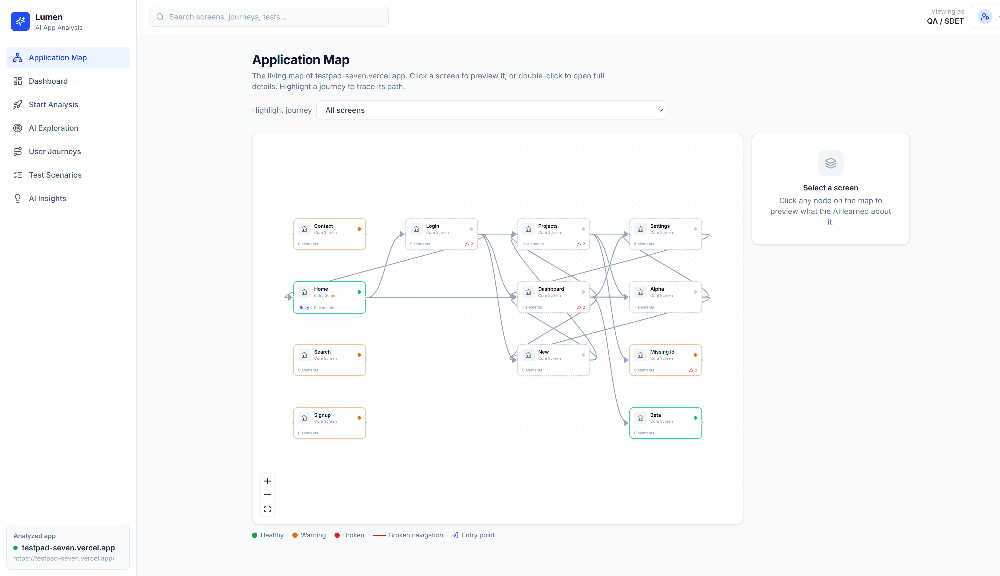
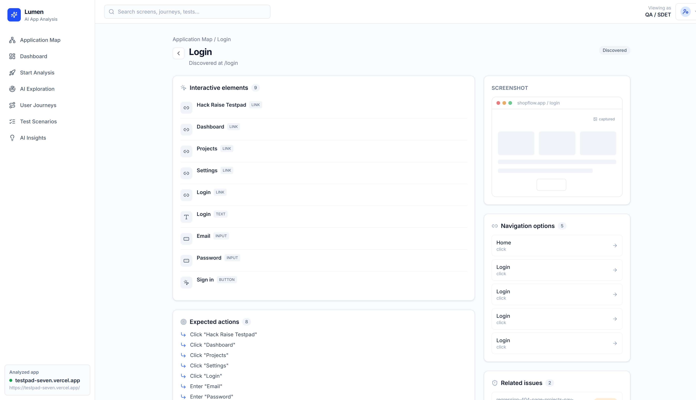
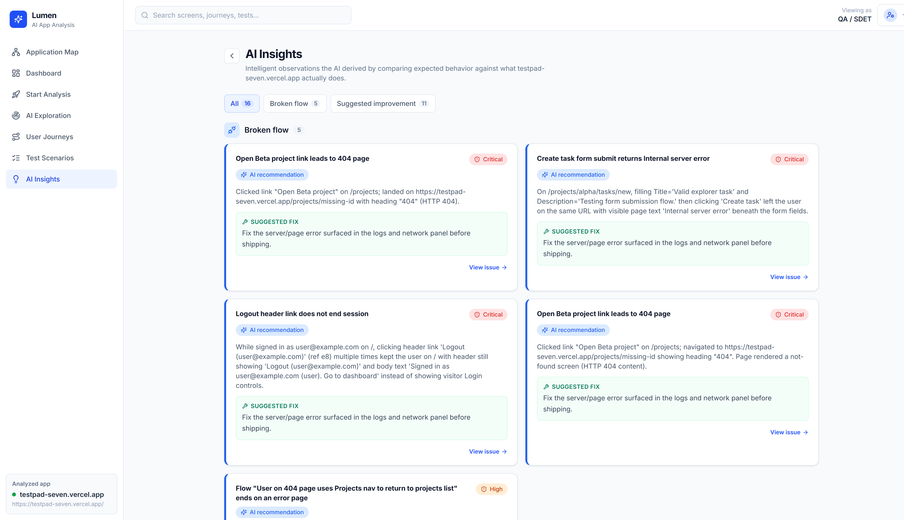
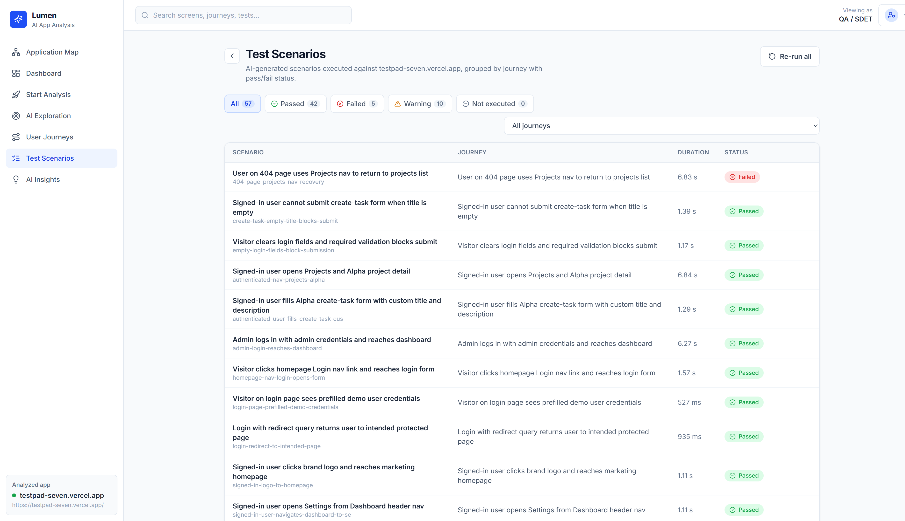

# Lumen — the dashboard for autoend

Lumen is the web dashboard for [**autoend**](https://github.com/bonyadnouri/autoend). autoend's AI agents explore and test your web app; Lumen shows what they found — a map of your app's screens, the journeys and tests they ran, the details of each screen, and the problems and suggestions they turned up — **updating live while a run is happening**.

Data is stored in [Supabase](https://supabase.com). With no database configured, Lumen shows built-in sample data so you can click around offline.



## Related projects

- **[autoend](https://github.com/bonyadnouri/autoend)** — the tool that explores your app, runs the tests, and sends results to this dashboard.

## What you can see

- **App map** — an interactive diagram of every screen the agents reached and how they move between them. Colors show status: healthy, warning (for example, a page the AI expected but that turns out to be missing), or broken. Click a journey to trace its path across the map.
- **Screen details** — the buttons, links, and inputs on a screen, where it can navigate to, which journeys passed through it (and whether they passed or failed), and the tests and issues tied to it.
- **Tests** — every test the agents ran or discovered, with pass / fail / warning status, filterable by outcome and journey.
- **Issues and insights** — problems ranked by severity, each with a suggested fix and a full investigation (video, network activity, console logs, timeline).
- **Live runs** — start an analysis from the dashboard, pick a model, and watch screens, connections, and tests appear in real time.

| | |
|---|---|
|  |  |



## How it connects to autoend

Run `autoend serve` as a background service. When you start an analysis in Lumen, autoend picks it up, tests your app, and sends results back to the shared database — some live during the run, the rest when it finishes.

- **During the run:** screens and connections appear on the map as the agents navigate, and each test flips to pass or fail as it settles.
- **When the run finishes:** journeys, issues, insights, and the summary are saved together, so the dashboard only switches to a finished run once everything is ready.

## Tech

- Vite + React + TypeScript
- Tailwind CSS
- React Router
- [React Flow](https://reactflow.dev) (`@xyflow/react`) for the interactive map
- Supabase (`@supabase/supabase-js`) + TanStack Query, with Supabase Realtime for live updates
- `lucide-react` icons

## Run it

```bash
npm install
npm run dev      # http://localhost:5173
npm run build    # type-check and build for production
npm run preview  # preview the production build
```

Without a database configured, Lumen automatically shows sample data, so every page is browsable offline.

## Connect a database (Supabase free tier)

1. Create a project at [supabase.com](https://supabase.com) (signing in with GitHub is fine).
2. In **Project Settings → API**, copy the **Project URL** and the **anon public key**.
3. Create your local env file and fill in those two values:

   ```bash
   cp .env.example .env.local
   ```

   ```
   VITE_SUPABASE_URL=https://your-project.supabase.co
   VITE_SUPABASE_ANON_KEY=your-anon-key
   ```

4. Create the database tables:

   ```bash
   npm run db:migrate
   ```

5. (Optional) Add sample data so there's something to see before your first real run:

   ```bash
   npm run db:seed     # or: npm run db:setup  (create tables + add sample data)
   ```

6. Restart `npm run dev`.

> Access rules are left open and the recording storage is public for this demo, which means recorded video and screenshots are viewable by anyone with the link. Only analyze apps where that's acceptable — not production with real user data.

## Run a live analysis

1. Start the autoend background service (see the [autoend README](https://github.com/bonyadnouri/autoend)):

   ```bash
   autoend serve
   ```

2. In Lumen, open **Start Analysis**, enter your app's URL, pick a model, and start. If the service isn't running, the UI lets you know the run wasn't picked up.
3. Watch the **app map** fill in live, followed by the tests, then the final journeys, issues, and insights.

Each URL is its own project: re-running the same URL replaces that project's results, and a new URL becomes a separate project you can switch between in the sidebar.

You can also change an issue's status, and re-run a single test from its detail page.

## Pages

| Route | Page |
| --- | --- |
| `/` | App map (interactive diagram) |
| `/dashboard` | Summary metrics, coverage, and top issues |
| `/start` | Start a new analysis (URL + model picker) |
| `/exploration` | Live exploration progress and activity log |
| `/screens/:id` | Screen details — elements, navigation, journeys, tests, issues |
| `/journeys`, `/journeys/:id` | User journeys list and detail |
| `/tests`, `/tests/:id` | Tests list and investigation detail |
| `/insights` | AI insights, grouped by category with suggested fixes |
| `/issues/:id` | Issue details |

## Project layout

```
src/
  components/   # layout, sidebar, cards, investigation UI, map nodes
  context/      # shared state (current project, loaded data, role)
  data/         # sample data and helpers
  hooks/        # data fetching and updates
  lib/          # Supabase client, API calls, live sync, map layout
  pages/        # one component per page
  types/        # shared TypeScript types
supabase/
  migrations/   # database setup, in order
scripts/
  apply-schema.mjs    # used by db:migrate
  seed-database.mjs   # used by db:seed
```

## Status colors

Green = passed / healthy · Amber = warning · Red = failed / broken · Blue = AI suggestion.
