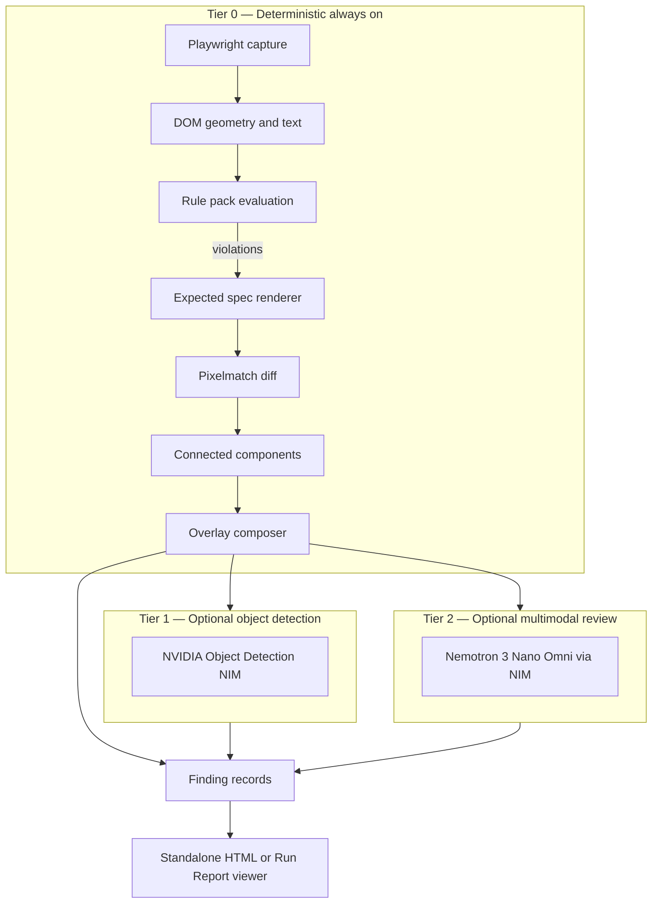

# Visual Integrity

Visual Integrity is a design-QA layer inside **autoend** that catches **violations of published design standards** — not merely “the page changed.” It combines deterministic browser capture, classical computer-vision diffing, DOM geometry, dynamically rendered design-spec references, and optional NVIDIA Nemotron multimodal review. Output is normal **Finding** records with rich visual evidence and an interactive forensic report.

Works **standalone** (`pnpm visual:demo`) or **integrated** into an autoend Run (`VISUAL_INTEGRITY=rules`).

---

## What it detects

Each **rule pack** encodes a real design system as executable policy:

| Rule pack | Applies to | Example violation |
| --- | --- | --- |
| `cms-healthcare` | HealthCare.gov / CMS apps | Missing USA Banner on Plan Finder |
| `uswds-federal` | `.gov` / `.mil` federal sites | Missing official government banner |
| `dsfr-france` | `.gouv.fr` | Missing DSFR en-tête (Marianne / République Française) |
| `google-material` | Google product pages | Missing standard product chrome (wordmark + account affordance) |

Every violation cites a **rule ID**, **expected vs actual**, severity, screenshot evidence, bounding boxes, and (optionally) an AI rationale.

**Primary demo:** [finder.healthcare.gov](https://finder.healthcare.gov/) omits the CMS Design System USA Banner required for HealthCare.gov-style `.gov` pages — rule `CMS-HCGOV-BANNER-001`.

---

## Architecture



**Single orchestrator:** `analyzeVisualIntegrity()` in `src/visual/analyze.ts`. Replay, Run, CLI, and tests all call this — nothing else reaches into capture/diff/providers directly.

---

## Computer vision stack

Visual Integrity is built to feel like a **visual forensics workstation**: heatmaps, region boxes, spec ghosts, and a drag-cut compare slider — without shipping heavyweight ML dependencies for the default path.

### Fixed viewport capture (resolution-normalized truth)

All captures use Playwright at **1280×720** with animations disabled. Screenshots are taken at a **single canonical resolution** so pixel diffs are apples-to-apples. Cross-resolution comparison across arbitrary devices is out of scope for v1; the pipeline normalizes to one viewport so government and enterprise demos stay reproducible.

Artifacts per capture:

- Full viewport PNG (`actual.png`)
- Top chrome crop — first **220px** (`actual-top-region.png`) — where banners/headers live
- Visible text, top-region text, logo alt/aria signals, accessibility landmark summary
- DOM bounding boxes for headers, nav, h1, buttons, privacy links, `usa-banner`-like selectors

### Pixel-level diffing (`pixelmatch` + `pngjs`)

When a rule fails, the engine compares the **actual top-region crop** against a **dynamically rendered expected reference** (see below). Diffing uses [pixelmatch](https://github.com/mapbox/pixelmatch):

- Per-pixel RGBA comparison with anti-aliasing tolerance (`threshold: 0.15`)
- **Band-scoped diffs** — only the vertical band of the violated component is compared (e.g. banner rows `y∈[0,40)`), not the entire 220px strip. This avoids measuring “two different layouts” as one meaningless 50% delta.
- Outputs a **heatmap PNG** (red changed pixels) and a **binary diff mask**

### Connected-component region detection (synthetic segmentation)

Changed pixels are grouped into coarse **bounding-box regions** using a block grid (16×16 blocks, minimum cluster size). This produces segmentation-like masks and region labels **without running SAM or a segmentation model** — fast, deterministic, and sufficient for banner/header violations.

Overlays carry `source: 'pixel-diff' | 'dom-geometry' | 'design-contract' | 'model'`.

### DOM geometry layer

`getBoundingClientRect()`-driven boxes for semantic landmarks. Rule packs also scan **visible text** and **top-region logo alt text** (wordmarks often render as images, not selectable text). Together this is the **authoritative Tier 0 verdict** — no API key required.

### Expected spec rendering (ghost overlays)

Instead of static reference PNGs checked into git, the module **renders HTML/CSS approximations** of design-system components in Playwright at the same viewport (`src/visual/expected-renderer.ts`):

- CMS / USWDS USA Banner
- HealthCare.gov header
- DSFR en-tête
- Google product chrome

These become the left side of the **spec comparison slider** and translucent “required here — not found” contract boxes on the report.

### Per-Flow baseline regression (screenshot baselines)

During Flow replay, the first successful pass **mints** `.autoend/flows/<flowId>/baseline.png`. Subsequent replays **pixel-diff** the after-screenshot against that baseline (`src/visual/baseline.ts`). Threshold: **2% changed pixels** → regression Finding with diff heatmap. Dismiss on a baseline Finding **updates the baseline** to accept intentional visual change.

---

## NVIDIA Nemotron integration

AI is **advisory only**. Deterministic rules decide whether a violation exists; the model explains and prioritizes.

### Tier 2 — Nemotron 3 Nano Omni (multimodal review)

**When:** Only after Tier 0 finds violations, and only when `VISUAL_INTEGRITY=models` with `VISUAL_MODEL_PROVIDER=nvidia` and `VISUAL_MODEL_EFFORT=fast|deep`.

**Model:** `nvidia/nemotron-3-nano-omni-30b-a3b-reasoning` (override via `NVIDIA_NEMOTRON_MODEL`).

**Endpoint:** NVIDIA NIM OpenAI-compatible `POST /v1/chat/completions` at `https://integrate.api.nvidia.com/v1`.

**Inputs (multimodal message):**

1. Text prompt with explicit **IMAGE 1 = actual live capture**, **IMAGE 2 = expected reference (not the page)**, plus deterministic violation list and truncated DOM text
2. Base64 PNG of actual top-region crop
3. Base64 PNG of expected reference render (when available)

**Output (strict JSON):**

```json
{
  "classification": "rule-violation | likely-regression | likely-intentional | needs-human",
  "confidence": 0-100,
  "summary": "one sentence",
  "ruleIds": ["..."],
  "rationale": "short reasoning",
  "recommendedFix": "short suggestion"
}
```

Responses are parsed with a **brace-balanced JSON extractor** that strips reasoning-model `<think>` blocks and markdown fences. Results are **cached** by hash of image bytes + rule pack version + model id + prompt version (`PROMPT_VERSION=2`).

**Important:** If the model disagrees with deterministic rules (`likely-intentional` while violations exist), the UI warns that **deterministic rules are source of truth**.

### Tier 1 — Object detection NIM (optional)

When `NVIDIA_OBJECT_DETECTION_URL` is set and mode is `models`, the **top-region crop only** is sent to a NIM object-detection `/v1/infer`-style endpoint. Returned boxes are normalized into `VisualOverlay[]` with `source: 'model'`. Failure degrades to an empty list — never breaks the Run.

Tier 1 is for canvas-heavy pages where DOM geometry is thin. Not required for the Plan Finder demo.

---

## Tools and dependencies

| Tool | Role |
| --- | --- |
| **Playwright** | Headless Chromium, fixed viewport, screenshots, DOM evaluation |
| **pixelmatch** | Per-pixel RGBA diff, heatmap + diff mask generation |
| **pngjs** | PNG read/write, band cropping for scoped diffs |
| **tsx** | Run TypeScript CLI and batch scripts directly |
| **Vitest** | Unit tests (`test/providers.test.ts`) and live E2E (`test/visual-integrity.e2e.test.ts`) |
| **NVIDIA NIM** | Nemotron multimodal chat + optional object detection |
| **Vite + React** | Integrated Report viewer (`VisualComparePanel`, `VisualIntegrityCard`) |
| **Static HTML viewer** | Standalone zero-backend forensic dashboard (`standalone-viewer.ts`) |

---

## Usage

### Standalone demo

```bash
cd apps/autoend

# Auto-detect rule pack from URL
pnpm visual:demo --url https://finder.healthcare.gov/ --no-open

# With Nemotron review (requires NVIDIA_NIM_API_KEY in repo-root .env)
pnpm visual:demo --url https://finder.healthcare.gov/ --provider nvidia --effort deep --no-open

# Explicit rule pack override
pnpm visual:demo --url https://example.com/ --rule-pack uswds-federal --no-open
```

Reports land in `.visual-integrity/demo-runs/<timestamp>/` (`index.html` + `report.json` + PNGs). This directory is **gitignored** — regenerate anytime.

### Integrated autoend Run

```bash
VISUAL_INTEGRITY=rules pnpm dev https://finder.healthcare.gov/ --effort low --no-serve --no-open
```

Visual findings merge into `report.json`. Full interactive report: `evidence/visual/index.html` inside the run artifact dir.

### Batch gallery (research / demos)

```bash
pnpm exec tsx scripts/batch-visual-demos.mts
pnpm exec tsx scripts/verify-batch-reports.mts   # programmatic UI/data checks
pnpm exec tsx scripts/refresh-batch-viewers.mts  # re-render HTML after viewer fixes
```

Target list includes Whitehouse.gov, NASA, weather.gov, NOAA, USA.gov, Plan Finder, HealthCare.gov, French `.gouv.fr` sites, and Google properties. Output: `.visual-integrity/demo-runs/batch-<timestamp>/` with `manifest.json` + per-site report dirs — **not committed** (see below).

---

## Environment variables

See [CONTEXT.md](../CONTEXT.md#visual-integrity-environment-variables) for the full table. Minimum for Nemotron:

```bash
VISUAL_INTEGRITY=models
VISUAL_MODEL_PROVIDER=nvidia
VISUAL_MODEL_EFFORT=deep
NVIDIA_NIM_API_KEY=nvapi-...
```

Rules-only mode needs **no API keys**.

---

## Module map

```
src/visual/
  analyze.ts           # Orchestrator
  capture.ts           # Playwright capture + DOM boxes
  diff.ts              # Pixelmatch + connected components
  baseline.ts          # Per-Flow baseline compare
  expected-renderer.ts # Dynamic spec renders
  overlays.ts          # Deterministic overlay composer
  providers.ts         # NVIDIA NIM / Nemotron adapter
  findings.ts          # Violation → Finding conversion
  rules.ts             # Rule pack registry + auto-detect
  rule-packs/          # cms-healthcare, uswds-federal, dsfr-france, google-material
  standalone-viewer.ts # Forensic HTML dashboard
  standalone-report.ts # report.json schema
  cli-demo.ts          # pnpm visual:demo entry
  run-check.ts         # Integrated Run hook
  exceptions.ts        # Dismiss → visual-exceptions.json
  perf.ts              # Timing budgets + model response cache

viewer/src/components/investigation/
  VisualComparePanel.tsx    # Drag-cut spec slider (React)
  VisualIntegrityCard.tsx   # Finding details panel

scripts/
  batch-visual-demos.mts    # Multi-site gallery generator
  verify-batch-reports.mts  # Report verification harness
  refresh-batch-viewers.mts # Re-render batch HTML from saved JSON

test/
  providers.test.ts         # JSON extraction unit tests
  visual-integrity.e2e.test.ts  # Live finder.healthcare.gov E2E
```

---

## Generated artifacts vs committed code

| Path | Committed? | Notes |
| --- | --- | --- |
| `src/visual/**` | Yes | Module source |
| `test/visual-integrity.e2e.test.ts` | Yes | Hits live URL at test time; uses temp dirs |
| `scripts/batch-*.mts`, `verify-batch-reports.mts` | Yes | **Generators** — not their output |
| **`showcase/visual-integrity/**`** | **No** (gitignored) | **Teammate showcase bundle** — stable path, regenerate with `pnpm visual:showcase`, share via zip |
| `.visual-integrity/demo-runs/**` | **No** (gitignored) | Dev scratch runs |
| `.visual-integrity/cache/**` | **No** (gitignored) | Cached Nemotron JSON responses |
| `.autoend/runs/**` | **No** (gitignored) | Integrated Run artifacts |

**Teammate handoff:** see **[docs/showcase-handoff.md](./showcase-handoff.md)** — zip, shared folder, or local regen; never commit PNGs/HTML to git.

**The website samples (PNG screenshots, HTML reports, batch gallery) are local demo output.** Clone the branch, run `pnpm visual:showcase`, and they appear in `showcase/visual-integrity/` in ~5–15 minutes.

---

## Report UI

### Standalone forensic dashboard

Single-page, dark-themed, zero-scroll mission control:

- Verdict lockup with violation count and severity
- **Spec comparison** — drag-cut slider between expected render and live capture
- Layer toggles: spec region, pixel delta heatmap
- **Page map** — full capture with DOM-detected element boxes
- **AI review card** — Nemotron classification, rationale, recommended fix
- Pipeline timing strip (capture → rules → diff → overlays → AI)

### Integrated Report viewer

`VisualIntegrityCard` in Finding details: rule citation, captures, diff, AI block, link to full `evidence/visual/index.html`. `VisualComparePanel` ports the drag-cut slider into React.

---

## Performance budgets (advisory)

| Stage | Target |
| --- | --- |
| Page load + stabilize | 3–5s |
| Screenshot + DOM | <1s |
| Rule checks | <250ms |
| Pixel diff | <500ms |
| Overlay generation | <500ms |
| Tier 2 Nemotron (optional) | 5–15s |

Default demo: **<8s without models**, **<20s with one Nemotron call**.

Anti-bloat rules: no full-page images to models by default; no model call until deterministic violation exists; top-region crop only for Tier 1/2.

---

## Failure behavior

Visual Integrity **never breaks the main Run**:

- Capture failure → skip visual checks
- Expected render failure → text/DOM evidence only
- Model failure → deterministic findings remain; `modelReviewError` in report
- No applicable rule pack → no-op
- Browser launch failure in integrated mode → empty findings, Run completes

---

## Further reading

- Design plan: `.cursor/plans/visual_integrity_*.plan.md` (workspace)
- CMS USA Banner spec: https://design.cms.gov/components/usa-banner/
- CMS HealthCare.gov header: https://design.cms.gov/components/header/healthcare-header/
