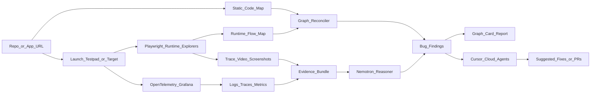

# Reordered E2E Graph Harness Plan

## Strategic Order
Cursor stays the main track. The updated plan makes Grafana and NVIDIA visible early because their materials directly support the core product story: agents should debug from evidence, not vibes.

- Cursor: orchestration, code understanding, Cloud Agent triage, suggested fixes or PRs.
- Playwright: deterministic browser exploration and proof artifacts.
- Grafana: backend/system evidence through logs, traces, metrics, and OpenTelemetry.
- NVIDIA Nemotron: open-model reasoning over the evidence bundle.

## Reordered MVP
1. Build the demo shell and hardcoded report first so the visual direction is visible immediately.
2. Build the buggy testpad app with OpenTelemetry instrumentation from day one.
3. Implement Playwright runtime exploration and browser evidence capture.
4. Add Grafana evidence links before static mapping, so every bug can point to trace/log/metric proof.
5. Add static route/code mapping for Next.js/React.
6. Reconcile static vs runtime graphs.
7. Build the report UI around graph + card replay + evidence drawer.
8. Add Cursor SDK/Cloud Agent triage and fix suggestions.
9. Add NVIDIA Nemotron evidence summarization or visual/UI interpretation.
10. Package and rehearse the full sponsor-aligned demo.

## Revised Architecture

## Updated Build Phases
### Phase 1: Sponsor-Aligned Skeleton
Create the monorepo, dashboard shell, shared graph schema, sample report fixture, and placeholder panels for Cursor, Grafana, Playwright, and Nemotron. The UI should show the final demo shape even before all integrations are live.

### Phase 2: Instrumented Testpad App
Build the intentionally buggy sample app with user/admin flows, seeded data, and deterministic failures. Instrument API/server actions/model-like calls with OpenTelemetry and add correlation IDs: `runId`, `scenarioId`, `route`, and `role`.

### Phase 3: Playwright Runtime Explorer
Implement bounded browser exploration, screen fingerprinting, and runtime graph output. Capture videos, traces, screenshots, HAR/network data, console logs, page errors, and action timelines.

### Phase 4: Grafana Evidence Loop
Use Grafana Alloy/OpenTelemetry to send logs, traces, and metrics to Grafana Cloud or a local LGTM stack. Each failed transition should link to exact Loki logs, Tempo traces, and route metrics.

### Phase 5: Static Code Mapper
Implement Next.js/React static mapping with route scanning and link extraction. Start with route nodes, source files, `next/link`, `router.push`, anchors, and obvious form/navigation actions.

### Phase 6: Graph Reconciliation
Compare code graph vs runtime graph. Classify missing runtime paths, runtime-only paths, broken transitions, role/security discrepancies, console errors, network failures, and backend trace anomalies.

### Phase 7: Report Experience
Build the React Flow graph, Framer Motion card-stack replay, findings list, artifact viewer, and evidence drawer. The evidence drawer should combine Playwright artifacts, Grafana links, and model-generated summaries.

### Phase 8: Cursor Integration
Use Cursor SDK/Cloud Agents for code graph review, bug explanation, and suggested fixes. Surface live agent status/events and make one suggested fix visible in the final demo.

### Phase 9: NVIDIA Nemotron Integration
Use Nemotron for one bounded, obvious task: summarize an evidence bundle, classify UI elements from screenshots, or safety-check agent exploration prompts. Show the model name, input artifacts, confidence, and output in the report.

### Phase 10: Parallelism and Demo Hardening
Run multiple scenarios by role/path in parallel. Add fallback fixtures for Grafana/Nemotron/Cursor so the demo survives API issues. Rehearse a 3-minute pitch around evidence-backed agent debugging.

## Side-Track Fit
Grafana becomes a core proof layer: "Give your agent evidence, not vibes." The product should visibly pivot from a failed UI edge to backend traces, logs, and metrics.

NVIDIA becomes the open-model reasoning layer. Nemotron should not be decorative; it should explain a real finding using browser and Grafana evidence.

Cloudflare/OpenRouter/Gradium remain useful but lower priority: Cloudflare for deploy/artifacts, OpenRouter as fallback routing, Gradium for voice/narrated reports if time remains.

## Revised Demo Script
1. Start a run against the buggy testpad app.
2. Watch Playwright explorers generate runtime screen cards.
3. Open a failed transition and show browser video/trace/screenshot evidence.
4. Click into Grafana evidence for the same failure: logs, trace waterfall, and metric spike.
5. Show the graph diff: code-intended route is unreachable at runtime.
6. Show Nemotron's concise explanation of the evidence bundle.
7. Show Cursor Cloud Agent proposing or previewing the fix.
8. End with: "Cursor agents fix from evidence, Playwright proves the browser path, Grafana proves the system path, and Nemotron reasons over the bundle."

## Success Criteria
- The demo finds at least 4 intentional testpad bugs.
- At least 2 findings include Grafana-linked evidence.
- At least 1 finding includes a Nemotron-generated explanation or visual/UI interpretation.
- At least 1 finding has a Cursor-generated fix suggestion.
- The report makes a failure understandable in under 10 seconds through graph + card replay + evidence drawer.