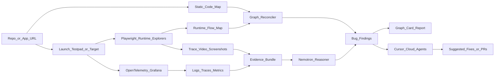

# Architecture (target)



## Monorepo (planned)

```
hack-raise/
├── apps/
│   ├── web/          # harness dashboard + report UI
│   └── testpad/      # intentionally buggy demo app
├── packages/
│   ├── graph-core/
│   ├── code-map/
│   ├── runner/       # Playwright workers
│   ├── observability/
│   ├── reasoning/    # Nemotron / model router
│   ├── cursor-orchestrator/
│   └── report/
└── docs/
```

## Cursor Cloud Agent orchestration (next code)

- API: `POST /runs` → spawn N cloud agents with scenario prompts
- One agent per shard (user flow, admin flow, smoke, etc.)
- Stream status via `@cursor/sdk` `run.stream()`
- User will define agent instructions later; stub with placeholder prompts now

## Data model (sketch)

- `ScreenNode`, `TransitionEdge`, `BugFinding`, `RunArtifact`, `ObservabilityEvidence`, `ReasoningResult`

See [2026-07-04-reordered-e2e-harness.md](../plans/2026-07-04-reordered-e2e-harness.md).
